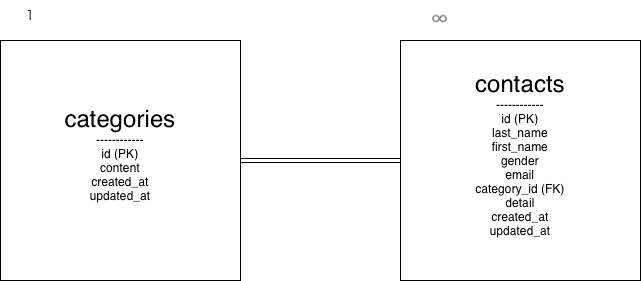

# contact-form

## アプリ概要

お問い合わせ内容を登録・管理するための管理システムです。
管理者はログイン後、一覧表示・検索・削除を行うことができます。

---

## 使用技術

- PHP 8.0
- Laravel 10.x
- MySQL 8.0
- Nginx
- Docker

---

## ER図



---

## 環境構築

### 1. リポジトリをクローン

```

git clone https://github.com/hime04158698-rgb/contact-form.git
cd contact-form

```

### 2. Docker起動

```
docker compose up -d --build
```

### 3. コンテナに入る

```
docker compose exec php bash
```

### 4. パッケージインストール

```
composer install
```

### 5. 環境ファイル作成

```
cp .env.example .env
php artisan key:generate
```

### 6. データベース構築

```
php artisan migrate --seed

```

---

## ログイン方法

初回アクセス時に管理者ユーザーを登録してください。
登録後、ログインして管理画面をご利用いただけます。

---

## 機能一覧

- ログイン機能
- 管理画面表示
- 一覧表示
- 検索機能
- 削除機能
- ページネーション

---

## URL

- トップページ：http://localhost/
- 管理画面：http://localhost/admin
